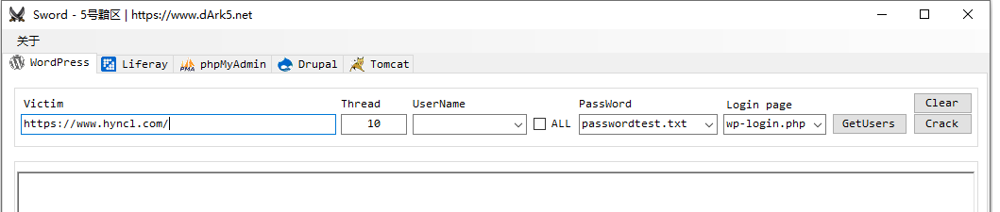
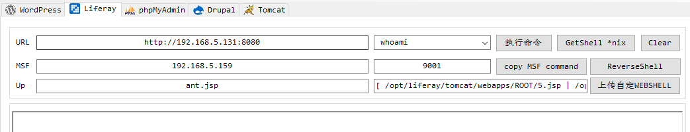
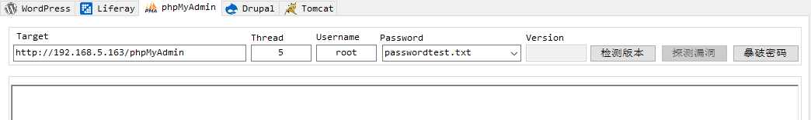
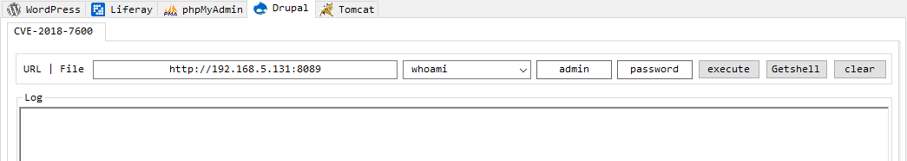
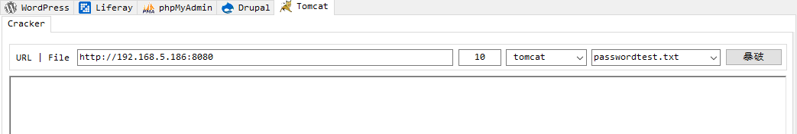
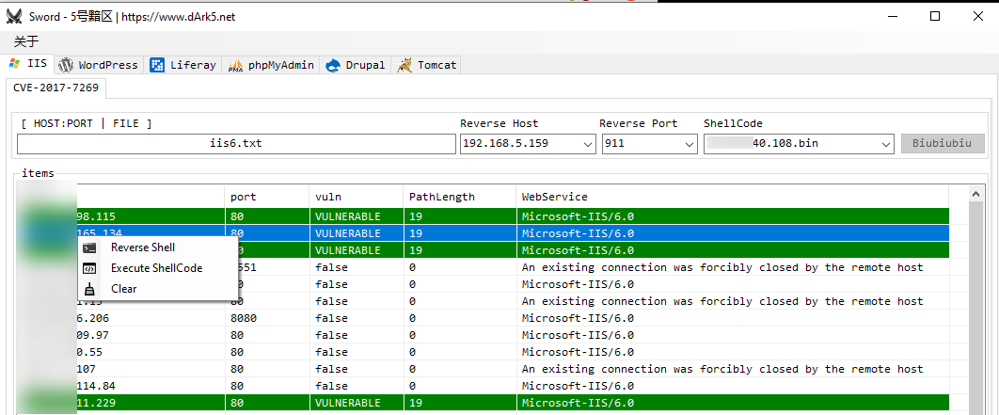
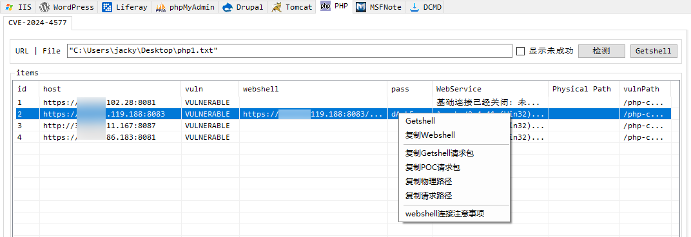
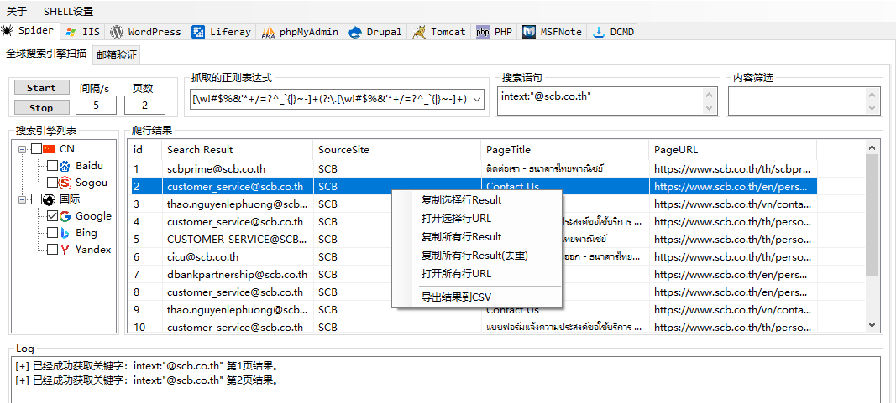

# Sword

+ WordPress

  WordPress用户名检测、登录密码暴破。直接点击`Crack`不会自动获取网站用户名并进行暴破，而是从`UserName`获取用户名，如果为空就会获取用户再暴破。Thead不建议修改。

  

+ Liferay

  CVE-2020-7961的漏洞利用，包括漏洞检测（执行一个命令）、命令执行、GetWebShell、上传自定义WebShell、MSF ReverseShell。
  
  
  
+ phpMyAdmin

  phpMyAdmin暴破，可检测版本。

  

+ Drupal
  
  CVE-2018-7600漏洞利用，包括命令执行、GetWebshell。
  
  
  
+ Tomcat
  
  tomcat密码暴破，注意：tomcat高于7版本默认会有防暴破机制，在5分钟之内同一账户登陆失败5次以上，但是返回包里面没有异常。

  

+ IIS6
  
  + CVE-2017-7269，iis6 webdav远程代码执行漏洞扫描、ReverseShell、shellcode执行。

  
  
  + HTTP PUT，批量扫描利用
  
    

+ PHP
  + CVE-2024-4577批量扫描，Getshell，getshell针对的是xampp的架构，通过其默认的`/dashboard/phpinfo.php`获取绝对路径写shell。当然，还可以通过执行命令读取apache的`confi/httpd.conf`文件，正则匹配`DocumentRoot`获取路径，还可以通过`dir /s /b c:\dashboard`遍历获取路径。
  
   
  
    

* Spider

  * 搜索引擎结果抓取，可以抓邮箱，URL等，主要看填入的正则表达式。

    目前只支持Google的爬取，todo：Baidu Sogou Bing Yandex.
    
    
