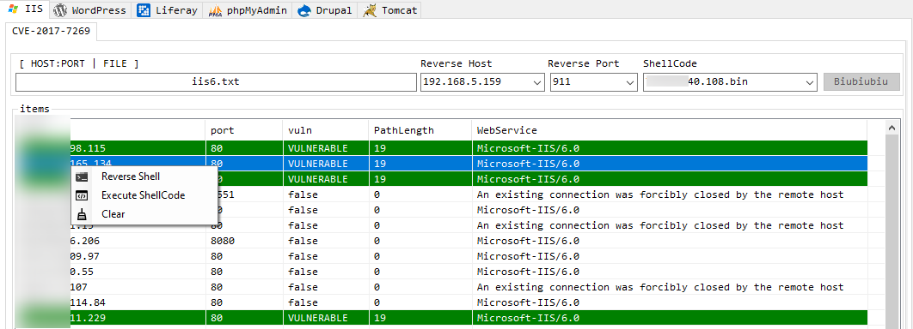

# Sword

+ WordPress

  WordPress用户名检测、登录密码暴破。直接点击`Crack`不会自动获取网站用户名并进行暴破，而是从`UserName`获取用户名，如果为空就直接暴破admin用户。Thead不建议修改。

  

+ Liferay

  CVE-2020-7961的漏洞利用。
  
  
  
+ phpMyAdmin

  phpMyAdmin暴破，可检测版本。

  

+ Drupal
  
  CVE-2018-7600漏洞利用。	
  
  
  
+ Tomcat
  
  tomcat密码暴破，注意：tomcat高于7版本默认会有防暴破机制，在5分钟之内同一账户登陆失败5次以上，但是返回包里面没有异常。

  

+ IIS
  
  CVE-2017-7269，iis6 webdav远程代码执行漏洞扫描、ReverseShell、shellcode执行。

  